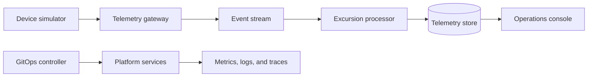

# ColdRoute Platform

ColdRoute Platform is a fictional, production-shaped Kubernetes platform for
processing and operating cold-chain telemetry workloads.

The project will demonstrate a complete platform engineering workflow across
application delivery, GitOps, observability, security, progressive delivery,
and disaster recovery.

## Planned Architecture

## Project Status

The repository is in its initial planning stage. Application services,
Kubernetes manifests, infrastructure modules, and automated delivery workflows
will be introduced in small, independently verifiable milestones.

## Public-Safety Boundary

All infrastructure, telemetry, identities, endpoints, and operational scenarios
in this repository are fictional. The project will not contain credentials,
customer data, employer configuration, or production access details.
