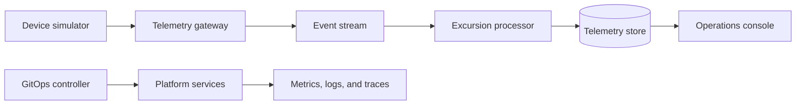

# ColdRoute Platform

<p align="center">
  
  
</p>

ColdRoute Platform is a fictional, production-shaped Kubernetes platform for
processing and operating cold-chain telemetry workloads.

The project will demonstrate a complete platform engineering workflow across
application delivery, GitOps, observability, security, progressive delivery,
and disaster recovery.

## Planned Architecture



## Project Status

Milestone 1 is in progress. The repository currently contains a deterministic
Python device simulator that emits newline-delimited JSON telemetry. Application
services, storage, Kubernetes manifests, infrastructure modules, and automated
delivery workflows will be introduced in small, independently verifiable
milestones.

## Device Simulator

The first component models a refrigerated shipment sensor. It produces a stable
event contract with configurable temperature drift and seeded jitter, allowing
later services and tests to replay the same telemetry sequence.

```bash
python -m venv .venv
source .venv/bin/activate
python -m pip install -e .
coldroute-simulate --count 3 --seed 42
```

Run the tests with the Python standard library:

```bash
python -m unittest discover -s tests -v
```

The next milestone will introduce an HTTP telemetry gateway that accepts this
event contract. No database, message broker, or Kubernetes resources are part of
the project yet.

## Public-Safety Boundary

All infrastructure, telemetry, identities, endpoints, and operational scenarios
in this repository are fictional. The project will not contain credentials,
customer data, employer configuration, or production access details.
